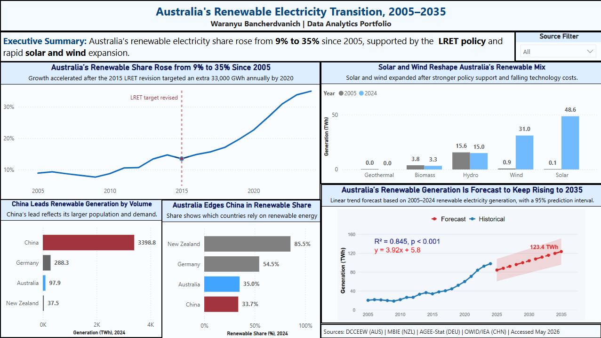

# ⚡ Renewable Electricity Transition Dashboard

A Power BI business intelligence project analysing Australia's renewable electricity transition from 2005 to 2024, comparing Australia with China, Germany, and New Zealand, and forecasting Australia's renewable progress to 2035 using R.

Built for **ISYS6013 Business Intelligence and Analytics** at Curtin University by **Waranyu Bancherdvanich**, framed as an analytical brief for a government client (DCCEEW).

---

---

<!-- 📸 Add a dashboard screenshot here once you have one.
     Upload your image to the images/ folder, then replace the line below:

-->

---

## 🧩 The Question

The Australian government has a target of **82% renewable electricity by 2030**. This project asks a single practical question for a government audience: *is Australia on track, and if not, how far short will it fall?*

The dashboard answers four sub-questions:
1. How has Australia's renewable electricity **share** changed since 2005?
2. How has Australia's renewable **source mix** changed (which technologies are driving growth)?
3. How does Australia **compare internationally** with China, Germany, and New Zealand?
4. What does a **forecast to 2035** suggest about reaching the target?

---

## 📊 Key Findings

- Australia's renewable share rose from about **9% in 2005 to 35% in 2024**, but a linear forecast reaches only about **44.6% by 2035**, well short of the 82% goal. Australia is moving in the right direction but not fast enough.
- The transition is now driven by **solar and wind**, not hydro. Solar grew from ~0.1 TWh to ~48.6 TWh and wind from ~0.9 TWh to ~31.0 TWh between 2005 and 2024, while hydro stayed roughly flat.
- **International comparison depends on the measure.** China generates the most renewable electricity by volume (~3,398 TWh) but Australia's renewable *share* (35.0%) slightly edged China's (33.7%) in 2024. New Zealand (85.5%) and Germany (54.5%) remain well ahead on share.

---

## 🛠️ Tools & Techniques

**Power BI** (data model, Power Query ETL, DAX measures, report design) · **DAX** · **R** (linear regression forecast inside a Power BI R script visual) · **Galaxy schema** data modelling

---

## 🏗️ How It's Built

**Data model — galaxy schema.** Two fact tables (`fact_RenewableGeneration`, `fact_TotalGeneration`) share three dimension tables (`dim_Country`, `dim_Year`, `dim_EnergySource`). A single fact table would have repeated total-generation values 5–6 times per country-year and caused overcounting if summed; the galaxy schema prevents that.

**ETL.** Four national datasets with different formats, units, and source categories were cleaned and standardised in Power Query into five consistent renewable categories (solar, wind, hydro, biomass, geothermal). Every transformation is recorded in the [data decisions log](docs/data-decisions-log.md).

**DAX measures.** Renewable share, renewable/total/non-renewable generation, GWh→TWh conversions, and renewable source mix percentage. See [dax-measures.md](docs/dax-measures.md).

**Forecasting.** Two R linear-regression visuals (one for generation in TWh, one for renewable share %) forecast to 2035 with a 95% prediction interval. R was used over Power BI's built-in forecast because it prints the regression equation, R², and p-value directly on the chart, making the method transparent and verifiable. Both models fit well (R² ≈ 0.845–0.847, p < 0.001). See [r-forecast-code.R](docs/r-forecast-code.R).

**The dashboard** is a single page with five visuals (line chart, clustered column, two clustered bar charts, and the R forecast visual), a title and summary block, and scoped slicers so filtering one question never breaks another.

---

## 🗂️ Data Sources

| Country | Source | Notes |
|---------|--------|-------|
| Australia | DCCEEW, Australian Energy Statistics Table O | Financial years converted to calendar years (end-year convention) |
| New Zealand | MBIE Electricity Statistics | Net generation (differs from gross by ~1–2%) |
| Germany | Umweltbundesamt / AGEE-Stat | Values extracted manually from the official PDF |
| China | Our World in Data (sourcing IEA) | English NBS data not freely available; OWID used as authoritative intermediary |

---

## 📁 Repository Contents

- `renewable-electricity-dashboard.pbix` — the Power BI file
- `docs/dax-measures.md` — all DAX measures with comments
- `docs/r-forecast-code.R` — the R forecasting script
- `docs/data-decisions-log.md` — full ETL and analytical decisions log
- `images/` — dashboard screenshots

---

## ⚠️ Limitations & Future Improvements

- The forecast is a simple **linear regression**, so it should be read as a planning signal, not a guaranteed result. Renewable growth accelerated after the mid-2010s, so including the slower early years makes the trend conservative.
- New Zealand reports **net** generation while Australia and Germany report **gross** (a <2% difference, noted for transparency).
- A future version could use **scenario-based or multiple linear regression**, since renewable growth depends on policy, technology cost, investment, storage, and grid capacity, not just time.

---

## 📫 Author

**Waranyu (JO) Bancherdvanich** — [LinkedIn](https://www.linkedin.com/in/waranyu-ban) · [GitHub](https://github.com/jo-bancherdvanich)
