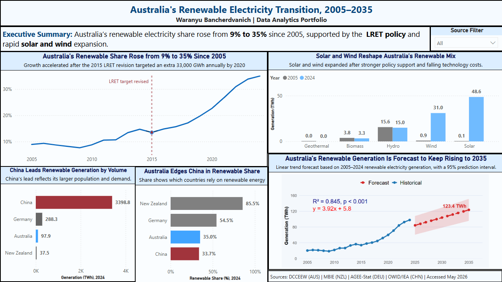
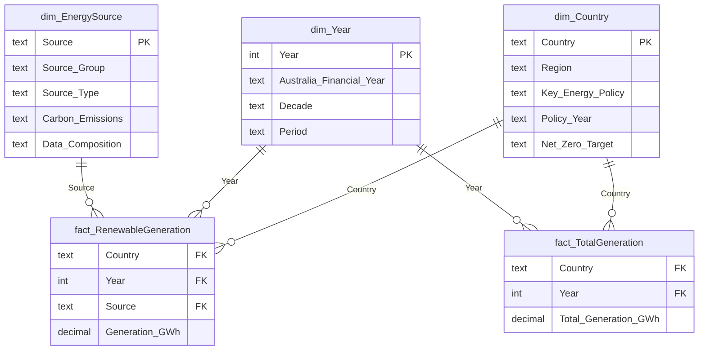

# Australia's Renewable Electricity Transition, 2005–2024

**Analytical report for the Department of Climate Change, Energy, the Environment and Water (DCCEEW)**
Waranyu Bancherdvanich · ISYS6013 Business Intelligence and Analytics, Curtin University

> Read this version on GitHub, or download the
> [PDF](../report/renewable-electricity-report.pdf) for the full-size Power BI figures.

---

## Contents

- [Executive summary](#executive-summary)
- [1. Introduction](#1-introduction)
- [2. Report findings](#2-report-findings)
  - [2.1 Australia's renewable electricity share since 2005](#21-australias-renewable-electricity-share-since-2005)
  - [2.2 Changes in Australia's renewable source mix](#22-changes-in-australias-renewable-source-mix)
  - [2.3 International comparison](#23-international-comparison-of-renewable-electricity-performance)
  - [2.4 Forecast to 2035](#24-forecast-of-australias-renewable-electricity-progress-to-2035)
- [3. Conclusion](#3-conclusion)
- [Appendix A — Data sources and metadata](#appendix-a--data-sources-and-metadata)
- [Appendix B — Data cleaning and transformation decisions](#appendix-b--data-cleaning-and-transformation-decisions)
- [Appendix C — Power BI data model](#appendix-c--power-bi-data-model)
- [Appendices D–F](#appendices-df)
- [Reference list](#reference-list)

---

## Executive summary

This report analyses Australia's renewable electricity transition from 2005 to 2024, compares Australia with China, Germany, and New Zealand, and forecasts Australia's renewable electricity progress to 2035. The analysis was completed in Power BI using annual electricity generation data from Bundesnetzagentur (2025), DCCEEW (2025), MBIE (2025), and OWID (2026). DAX measures were used to calculate renewable share, renewable generation, source mix, and non-renewable generation. An R-based linear regression model was used to forecast Australia's renewable generation and renewable share.

**The most important finding is that Australia has made clear progress, but the current trend is still not fast enough to reach the 82% renewable electricity goal by 2030** (DCCEEW, 2026). Australia's renewable electricity share increased from about 9% in 2005 to 35% in 2024 (DCCEEW, 2025). However, the renewable share forecast suggests Australia may only reach about 44.6% by 2035 if the historical linear trend continues. Stronger action is needed to close the gap to the national target.

The report also found that Australia's renewable mix has changed substantially. In 2005 hydro was the main renewable source; by 2024 solar and wind had become the main drivers of growth. Solar increased from about 0.1 TWh to 48.6 TWh, and wind from about 0.9 TWh to 31.0 TWh (DCCEEW, 2025). This matters because solar and wind require stronger grid capacity, storage, transmission, and investment planning.

The international comparison shows Australia's performance depends on which measure is used. China generated far more renewable electricity in total volume (OWID, 2026), but Australia slightly outperformed China on renewable share in 2024. New Zealand and Germany still had much higher renewable shares (Bundesnetzagentur, 2025; MBIE, 2025). Germany is a useful example of how long-term policy support and investment can raise renewable share (Agora Energiewende, 2024).

In conclusion, Australia is moving in the right direction, but the current rate of growth remains insufficient to support the 82% goal in 2030 (DCCEEW, 2026). Australia will likely need stronger policy support, faster renewable investment, expanded grid capacity, and more storage infrastructure. Future analysis should use scenario-based forecasting or multiple linear regression, because renewable growth is affected by more than time alone — policy, technology costs, investment, storage, grid capacity, and electricity demand should also be included.

---

## 1. Introduction

Australia's electricity sector is transforming as renewable energy becomes a larger part of how the country generates electricity. DCCEEW (2026) states that Australia has the resources and capability to reach 82% renewable electricity by 2030, making it important to understand whether current progress is on track. However, Australia's renewable electricity share was only around 35% in 2024, which shows a large gap remains before the 2030 target. This report therefore analyses Australia's renewable electricity transition from 2005 to 2024, assesses whether current progress is moving toward the 82% goal, and forecasts renewable generation to 2035.

Renewable electricity **share** is useful because it shows how much of Australia's electricity comes from renewable sources relative to total generation. This differs from looking at renewable generation **volume** alone: a country may produce more renewable electricity yet still depend heavily on non-renewables if total demand also grows. Share therefore gives a clearer picture of whether renewables are becoming a bigger part of the system. The analysis also examines generation by source, because the transition depends on which technologies are growing — which in turn drives planning needs for grid capacity, storage, and investment.

The analysis was completed in Power BI using annual electricity generation data for Australia, China, Germany, and New Zealand from 2005 to 2024. Australia was the focus country; the others provide international comparison:

- **China** — its electricity system is far larger than Australia's, generating more than 9,000 TWh in recent years (U.S. Energy Information Administration, 2025).
- **Germany** — strong renewable policy experience through the *Energiewende*, with renewables at **54.5% of gross electricity consumption** in 2024 (Umweltbundesamt / AGEE-Stat, 2026). See the note on measurement bases below.
- **New Zealand** — already has a very high renewable share, at 85.5% in 2024 (MBIE, 2025).

> **⚠️ A note on Germany's denominator.** Germany's share in this report is renewable generation as a
> proportion of **gross electricity consumption** — the basis AGEE-Stat itself publishes, and its own
> 2024 figure is 54.4%. Australia's share is renewable generation as a proportion of **total
> generation**. The two are therefore *not* measured on identical bases, so Germany's figure is not
> strictly comparable with Australia's. Consumption and generation differ by net imports and exports,
> and Germany is a substantial electricity trader, so the gap is not negligible. Figures quoting
> Germany at around 59% use a third convention again — *net public generation*. This is carried as a
> known limitation of the comparison; see the conclusion.

The datasets were cleaned and standardised before import because countries used different source categories. After cleaning, renewable sources were grouped into solar, wind, hydro, biomass, and geothermal. DAX measures calculated renewable share, source mix percentage, generation totals, and non-renewable generation. An R-based linear regression visual then forecast Australia's renewable generation to 2035.

The report presents findings in four sections (2.1–2.4), followed by a conclusion and appendices covering the data model, ETL process, DAX measures, and data decisions log.

---

## 2. Report findings

*The Power BI dashboard. Figures 1–7 referenced below are the individual visuals from this dashboard; they appear at full size in the [PDF report](../report/renewable-electricity-report.pdf).*

### 2.1 Australia's renewable electricity share since 2005

Understanding how Australia's renewable share has changed since 2005 shows whether renewables are becoming a bigger part of the national electricity system — important for government planning given the 82% by 2030 goal (DCCEEW, 2026).

**Method.** Data was sourced from DCCEEW Australian Energy Statistics Table O (DCCEEW, 2025), covering financial years 2004–05 to 2023–24. To match the dashboard timeline, each financial year was treated as the ending calendar year, so 2023–24 was treated as 2024. Renewable share was calculated in Power BI by dividing renewable generation by total generation using a DAX measure — done in Power BI rather than Excel so the calculation stays dynamic and works with the data model. A line chart was used because this section focuses on change over time.

> **Figure 1.** Australia's Renewable Electricity Share, 2005–2024.
> *Note.* From Power BI dashboard based on DCCEEW Australian Energy Statistics, Table O.

**Findings.** Australia's renewable share increased from about 9% in 2005 to around 35% in 2024 (DCCEEW, 2025). The increase was not uniform. Growth was slow in the early years, and even after the Renewable Energy Target was split into the LRET and SRES in 2011, no rapid increase followed immediately (Clean Energy Regulator, 2026). Large renewable projects take time to plan, finance, approve, build, and connect to the grid. Policy uncertainty during the early 2010s may also have made investors cautious.

The stronger increase appears after the 2015 LRET revision, when the target was set at 33,000 GWh of additional renewable electricity by 2020 (Clean Energy Regulator, 2026). This gave clearer policy direction for large-scale investment. By September 2019 enough capacity had been approved to guarantee the target, which was met in January 2021. However, policy alone does not explain the increase — falling solar and wind costs, private investment, state-level policies, and grid development also contributed.

Australia is moving in the right direction, but the 2024 share remains well below the 82% goal. Closing the gap will likely require continued policy support, more investment, and better grid and storage infrastructure.

### 2.2 Changes in Australia's renewable source mix

Australia's transition is not only about producing more renewable electricity — it is about which sources are growing. Each renewable source has different infrastructure needs, so this distinction matters for government planning.

**Method.** Data from DCCEEW Table O (DCCEEW, 2025), grouped into five sources: solar, wind, hydro, biomass, geothermal. Original data was in gigawatt-hours (GWh) and converted to terawatt-hours (TWh) for readability (1 TWh = 1,000 GWh). Australia separates solar into small-scale and large-scale PV, so a Source Category dimension combined both into one Solar category. A clustered column chart was used to compare 2005 with 2024 directly.

> **Figure 2.** Australia's Renewable Electricity Source Mix, 2005 and 2024.
> *Note.* From Power BI dashboard based on DCCEEW Australian Energy Statistics Table O (DCCEEW, 2025).

**Findings.** The mix changed strongly between 2005 and 2024:

| Source | 2005 | 2024 | Change |
|---|---|---|---|
| Solar | ~0.1 TWh | ~48.6 TWh | Very large increase |
| Wind | ~0.9 TWh | ~31.0 TWh | Very large increase |
| Hydro | ~15.6 TWh | ~15.0 TWh | Roughly flat |
| Biomass | ~3.8 TWh | ~3.3 TWh | Slight decrease |
| Geothermal | ~0 | ~0 | Effectively undeveloped |

*Source: DCCEEW (2025).*

Hydro did not increase much because future growth is limited by water availability, suitable dam locations, and competition for scarce water. Geoscience Australia (2026) explains that future hydro growth is likely to come from small-scale projects and upgrades to existing plants rather than large new developments. Geothermal remained near zero because Australia has not developed utility-scale geothermal: projects need suitable underground heat, expensive drilling, and locations close to electricity markets, and many Australian geothermal resources are difficult or costly to develop (Clean Energy Council, 2023).

**Table 1.** Global renewable technology cost reduction, 2010–2024

| Technology | 2010 LCOE (USD/kWh) | 2024 LCOE (USD/kWh) | Approximate reduction |
|---|---|---|---|
| Utility-scale solar PV | 0.460 | 0.043 | ~90% |
| Onshore wind | 0.111 | 0.034 | ~70% |

*Note.* Data from IRENA (2025).

This change is explained by policy support, technology development, and natural conditions. The LRET supported large-scale projects while the SRES supported small-scale systems such as rooftop solar (Clean Energy Regulator, 2026). Solar and wind also became far cheaper, as Table 1 shows. Australia's geography supports both, with strong sunlight, consistent wind, and large land resources (DCCEEW, 2026).

### 2.3 International comparison of renewable electricity performance

This section uses both generation volume and share, because each shows a different part of the picture. Volume shows the size of renewable production; share shows how much a country relies on renewables within its own system. A large country such as China can produce far more renewable electricity than Australia yet have a similar or lower share, because its total demand is much larger.

**Method.** Annual generation data for the four countries, 2005–2024 (Bundesnetzagentur, 2025; DCCEEW, 2025; MBIE, 2025; OWID, 2026). Two horizontal bar charts compare countries in 2024 — horizontal layout makes country names clearer and comparison at a single point in time easier.

> **Figure 3.** Renewable Electricity Generation by Country, 2024.
> **Figure 4.** Renewable Electricity Share by Country, 2024.
> **Figure 5.** Renewable Electricity Share Trend by Country, 2005–2024.

**Findings.**

| Country | Renewable generation, 2024 | Renewable share, 2024 |
|---|---|---|
| China | ~3,398.8 TWh | 33.7% |
| Germany | 288.3 TWh | 54.5% |
| Australia | 97.9 TWh | 35.0% |
| New Zealand | 37.5 TWh | 85.5% |

*Sources: Bundesnetzagentur (2025); DCCEEW (2025); MBIE (2025); OWID (2026).*

If only volume is considered, China looks like the strongest performer — and that would be misleading. China has one of the world's largest electricity systems, generating about 9,300 TWh in 2023 (U.S. Energy Information Administration, 2025). Volume alone does not explain how much a country depends on renewables.

Share gives a different view. New Zealand led at 85.5%, followed by Germany at 54.5%. Australia reached 35.0%, slightly higher than China at 33.7%. China produced far more renewable electricity in total, but renewables made up a slightly smaller part of its system than Australia's. New Zealand's high share reflects natural advantages — hydro is a major part of its system, and geothermal is significant because of its location on a tectonic plate boundary (MBIE, 2018).

Over the full period (Figure 5), China had a higher share than Australia for most years, starting around 16% in 2005 and reaching 33.7% in 2024, while Australia started lower at about 9% and reached 35.0%. Australia therefore improved faster than China, especially after the mid-2010s. Germany reached 54.5% in 2024, supported by long-term policy including the *Energiewende* and the Renewable Energy Sources Act — evidence that consistent policy support and investment can raise renewable share (Agora Energiewende, 2024).

### 2.4 Forecast of Australia's renewable electricity progress to 2035

Forecasting matters because the government needs to know whether the current trend is strong enough to support the 82% goal. A forecast does not guarantee a future result, but it shows the likely direction if the historical trend continues, helping identify whether more policy support, investment, grid capacity, or storage may be needed.

**Method.** Australia's annual renewable electricity data, 2005–2024 (DCCEEW, 2025). Two R-based linear regression visuals were created in Power BI. R was used instead of Power BI's built-in forecast because it prints the regression equation, R², p-value, and 95% prediction interval directly on the chart, making the method transparent. Linear regression was chosen because it is simple, transparent, and interpretable for a non-technical government audience. The first forecast uses generation in TWh; the second uses renewable share as a percentage, calculated with the Renewable Share % measure.

> **Figure 6.** Australia's Renewable Electricity Generation Forecast to 2035.
> **Figure 7.** Australia's Renewable Electricity Share Forecast to 2035.

**Findings.**

| Forecast | R² | p-value | 2035 projection |
|---|---|---|---|
| Renewable generation (TWh) | 0.845 | < 0.001 | ~123.4 TWh |
| Renewable share (%) | 0.847 | < 0.001 | ~44.6% |

Both models fit well. The share forecast gives the more direct view of progress toward the target: about 44.6% by 2035 is higher than the 2024 level of ~35%, but still far below 82% — five years *after* the target year. On the historical linear trend alone, **Australia is not on track to reach 82% renewable electricity by 2030.**

**Interpretation and uncertainty.** The forecast is a simple linear regression and growth may not continue in a straight line. Using 2005–2024 gives a longer historical pattern but includes the slower pre-2015 period, which may make the forecast conservative. Using only 2015–2024 would give too few data points for a reliable long-term forecast and would be over-sensitive to recent changes. The forecast may therefore carry some bias depending on the period selected. Growth could accelerate with stronger policy support, more investment, faster grid upgrades, more storage, and lower technology costs — for example, the Australian Government's Capacity Investment Scheme aims to accelerate investment in wind, solar, and clean dispatchable capacity such as battery storage (DCCEEW, 2026). It could also slow with transmission delays, approval issues, supply chain problems, or weaker investment conditions. The forecast is best used as a planning signal, not a certain prediction.

**Ethical responsibility.** There is an ethical responsibility when presenting a forecast to a government client. The analyst must make clear that the prediction is not 100% correct and should not be treated as guaranteed. Communicating uncertainty through a prediction interval, rather than relying only on a single point estimate, is essential to that. The 95% prediction interval matters because it shows the future result could be higher or lower than the central forecast. A government client could make poor decisions if the uncertainty range were removed or the forecast presented as definite. The forecast should therefore be communicated honestly, with a clear explanation of its assumptions, limitations, and uncertainty.

---

## 3. Conclusion

This report analysed Australia's renewable electricity transition from 2005 to 2024 and assessed whether current progress is strong enough to support the 82% goal by 2030 (DCCEEW, 2026). The analysis used Power BI with annual generation data for Australia, China, Germany, and New Zealand. DAX measures calculated renewable share, generation, source mix, and non-renewable generation. An R-based linear regression model forecast generation and share to 2035, with a prediction interval to show uncertainty.

**Finding 1 — Progress is real but too slow.** Australia's renewable share rose from about 9% in 2005 to around 35% in 2024 (DCCEEW, 2025). Renewables are becoming a larger part of the system, but the remaining gap is large, and the forecast reaches only about 44.6% by 2035. Australia will need much faster growth than the historical trend to meet the target.

**Finding 2 — Solar and wind now drive the transition.** In 2005 hydro was the main renewable source; by 2024 solar (~48.6 TWh) and wind (~31.0 TWh) were the main drivers, while hydro stayed almost stable (DCCEEW, 2025). This matters for planning because solar and wind create different system needs, especially for grid capacity, storage, transmission, and investment.

**Finding 3 — Australia's international position depends on the measure.** China produced far more renewable electricity by volume, but Australia slightly outperformed China on share in 2024. New Zealand and Germany remain well ahead, showing Australia has improved but has room to grow. Germany shows how long-term policy support and investment can raise renewable share (Agora Energiewende, 2024).

**Limitations.** The forecast is a simple linear regression and should not be treated as guaranteed. It uses 2005–2024 data, which gives a longer trend but includes the slower pre-2015 period, making it conservative. Australian data was originally reported by financial year and converted to calendar year using the end-year convention, which may create a small timing difference against calendar-year countries. Using only 2015–2024 would give fewer data points and a less reliable forecast. Communicating uncertainty clearly is essential, which is why the prediction interval is included.

**A further limitation: the comparison countries are not all measured on the same basis.** Australia's renewable share is renewable generation over *total generation*. Germany's is renewable generation over *gross electricity consumption*, which is the basis AGEE-Stat publishes. Because consumption and generation differ by net trade, and Germany trades electricity heavily, the German figure is not strictly comparable with the Australian one. New Zealand additionally reports *net* rather than gross generation. A future version should restate every country on a single agreed basis before comparing them, and say which basis that is.

Australia is moving in the right direction, but not fast enough under the current trend. Closing the gap will likely require stronger policy support, faster renewable investment, expanded grid capacity, and more storage infrastructure. Future analysis should use scenario-based forecasting or multiple linear regression, since renewable growth depends on more than time — policy support, technology costs, grid capacity, storage, electricity demand, and investment levels should also be included.

---

## Appendix A — Data sources and metadata

All data was sourced from official national government or intergovernmental publications. Generation values are stored in GWh in the dataset and converted to TWh where appropriate for display.

### A1 — Primary data sources

| Country | Source organisation | Publication | Years | Accessed | Type | Notes |
|---|---|---|---|---|---|---|
| Australia | DCCEEW | Australian Energy Statistics, Table O | 2005–2024 | May 2026 | Gross generation (GWh) | Financial years converted to calendar years (end-year convention) |
| New Zealand | MBIE | Electricity Statistics, December 2025 Quarter | 2005–2024 | May 2026 | Net generation (GWh) | Annual GWh sheet used. Net differs from gross by ~1–2% |
| Germany | Umweltbundesamt / AGEE-Stat | Time Series for the Development of Renewable Energy Sources in Germany, Feb 2026 | 2005–2024 | May 2026 | Renewable: gross production (GWh) **Denominator: gross electricity *consumption*** (Table 7) | Published as PDF — values extracted manually. Note the denominator is consumption, not generation — see the caveat in Section 1 |
| China | Our World in Data / IEA | Energy Dataset | 2005–2024 | May 2026 | Generation (TWh → GWh) | Chinese official statistics not freely available in English; OWID used as authoritative intermediary sourcing IEA |

### A2 — Data composition and sub-source combinations

| Country | Raw sub-sources in original file | Combined into | Reason |
|---|---|---|---|
| Australia | Large-scale Solar PV, Small-scale Solar PV | Solar | Show total solar consistently across countries |
| Australia | Biomass (bagasse/wood), Biogas | Biomass | Match five-category structure |
| Australia | Wind, Hydro, Geothermal | Unchanged | Already single category in source |
| New Zealand | Wood, Biogas | Biomass | Match five-category structure |
| New Zealand | Hydro, Geothermal, Wind, Solar | Unchanged | Already single categories |
| Germany | Onshore Wind, Offshore Wind | Wind | Match single Wind category |
| Germany | Solid biomass, biogas, biomethane, sewage gas, landfill gas, biogenic waste | Biomass (All) | Match five-category structure |
| Germany | Solar PV, Hydro, Geothermal | Unchanged | Already single categories |
| China | Wind, Solar, Hydro, Biomass | Unchanged | OWID already aggregated sub-sources |
| China | Geothermal | Set to zero | Negligible capacity — Yangbajain plant ceased 2020, not separately reported in OWID |

---

## Appendix B — Data cleaning and transformation decisions

| Issue | Decision made | Reason |
|---|---|---|
| Australia reports by financial year (e.g. FY 2023-24) | Converted to calendar year using end-year convention — FY 2023-24 = 2024 | Align Australia with calendar-year countries |
| Sub-source categories differ across countries | Grouped all countries into five categories: Solar, Wind, Hydro, Biomass, Geothermal | Enable consistent, fair cross-country comparison |
| Australia separates large-scale and small-scale solar PV | Combined into one Solar category via `Source_Group` in `dim_EnergySource` | Show total solar and enable comparison |
| Australia separates bagasse/wood waste and biogas | Combined into one Biomass category | Match five-category structure |
| Germany reports onshore and offshore wind separately | Combined into one Wind category via `Source_Group` | Match single Wind category used elsewhere |
| Germany has seven biomass sub-categories | Combined into Biomass (All) | Sub-categories not meaningful for cross-country comparison |
| China geothermal negligible or within other renewables | Set to zero for all years | Yangbajain ceased 2020; negligible and not separately reported by OWID |
| All generation values originally in GWh | Stored in GWh in fact table; converted to TWh for display via DAX | Preserves raw integrity while making figures readable |
| China data in OWID published in TWh | Multiplied by 1,000 to convert to GWh before loading | Ensures consistent units across all countries |
| New Zealand reports net generation; Australia and Germany report gross | Acknowledged as limitation — difference typically < 2% | Not material at annual aggregation, but noted for transparency |
| `Policy_Year` in `dim_Country` could be summed by Power BI | Changed data type to Text in Power Query | Prevents Power BI treating it as a numeric measure |
| `Net_Zero_Target` year in `dim_Country` could be summed | Changed data type to Text in Power Query | Prevents accidental summation of target years |

---

## Appendix C — Power BI data model

The model follows a **galaxy schema**: two fact tables connected to three shared dimension tables. A single fact table would have repeated total-generation values 5–6 times per country-year and caused overcounting if summed; the galaxy schema prevents that.

### C1 — Table structure

| Table | Type | Rows | Grain | Key columns |
|---|---|---|---|---|
| `fact_RenewableGeneration` | Fact | 480 | One row per country, year, and source | Country, Year, Source, Generation_GWh |
| `fact_TotalGeneration` | Fact | 80 | One row per country and year | Country, Year, Total_Generation_GWh |
| `dim_Country` | Dimension | 4 | One row per country | Country, Region, Key_Energy_Policy, Policy_Year, Net_Zero_Target |
| `dim_Year` | Dimension | 20 | One row per year (2005–2024) | Year, Australia_Financial_Year, Decade, Period |
| `dim_EnergySource` | Dimension | 14 | One row per raw source | Source, Source_Group, Source_Type, Carbon_Emissions, Data_Composition |

### C2 — Relationships

| From (dimension) | To (fact) | Cardinality | Cross-filter direction |
|---|---|---|---|
| `dim_Country[Country]` | `fact_RenewableGeneration[Country]` | One-to-many (1:M) | Single |
| `dim_Country[Country]` | `fact_TotalGeneration[Country]` | One-to-many (1:M) | Single |
| `dim_Year[Year]` | `fact_RenewableGeneration[Year]` | One-to-many (1:M) | Single |
| `dim_Year[Year]` | `fact_TotalGeneration[Year]` | One-to-many (1:M) | Single |
| `dim_EnergySource[Source]` | `fact_RenewableGeneration[Source]` | One-to-many (1:M) | Single |

---

## Appendices D–F

These appendices are maintained as separate files in this repository:

- **Appendix D — Key DAX measures** → [`docs/dax-measures.md`](dax-measures.md)
- **Appendix E — R forecasting code** → [`docs/r-forecast-code.R`](r-forecast-code.R)
- **Appendix F — Data decisions log** → [`docs/data-decisions-log.md`](data-decisions-log.md)

---

## Reference list

Agora Energiewende. (2024). *Renewables in Germany's Energy Transition.* https://www.agora-energiewende.org/about-us/the-german-energiewende/what-is-the-role-of-renewable-energy-in-germany

Bundesnetzagentur. (2025). *Bundesnetzagentur publishes 2024 electricity market data.* German Federal Network Agency. https://www.bundesnetzagentur.de/SharedDocs/Pressemitteilungen/EN/2025/20250103_SMARD.html

Clean Energy Council. (2023). *Geothermal.* https://cleanenergycouncil.org.au/for-consumers/technologies/geothermal

Clean Energy Regulator. (2026). *Renewable Energy Target.* Australian Government Clean Energy Regulator. https://cer.gov.au/schemes/renewable-energy-target

DCCEEW. (2025). *Australian Energy Statistics, Table O: Electricity generation by fuel type 2023-24 and 2024.* Australian Government Department of Climate Change, Energy, the Environment and Water. https://www.energy.gov.au/publications/australian-energy-statistics-table-o-electricity-generation-fuel-type-2023-24-and-2024

DCCEEW. (2026). *Renewable energy.* https://www.dcceew.gov.au/energy/renewable

Geoscience Australia. (2026). *Hydro Energy.* Australian Government Geoscience Australia. https://www.ga.gov.au/scientific-topics/energy/resources/other-renewable-energy-resources/hydro-energy

IRENA. (2025). *Renewable Power Generation Costs in 2024.* https://www.irena.org/Publications/2025/Jul/Renewable-Power-Generation-Costs-in-2024

MBIE. (2018). *Geothermal energy generation.* Ministry of Business, Innovation and Employment, New Zealand. https://www.mbie.govt.nz/building-and-energy/energy-and-natural-resources/energy-generation-and-markets/geothermal-energy-generation

MBIE. (2025). *Energy in New Zealand 2025 — Electricity.* Ministry of Business, Innovation and Employment. https://www.mbie.govt.nz/building-and-energy/energy-and-natural-resources/energy-statistics-and-modelling/energy-publications-and-technical-papers/energy-in-new-zealand/energy-in-new-zealand-2025/electricity

OWID. (2026). *China — Energy Country Profile.* https://ourworldindata.org/profile/energy/china

Umweltbundesamt / AGEE-Stat. (2026). *Time Series for the Development of Renewable Energy Sources in Germany.* German Environment Agency, Working Group on Renewable Energy Statistics. https://www.umweltbundesamt.de/en/topics/climate-energy/renewable-energies/renewable-energies-in-figures

U.S. Energy Information Administration. (2025). *China — Analysis.* https://www.eia.gov/international/analysis/country/CHN
